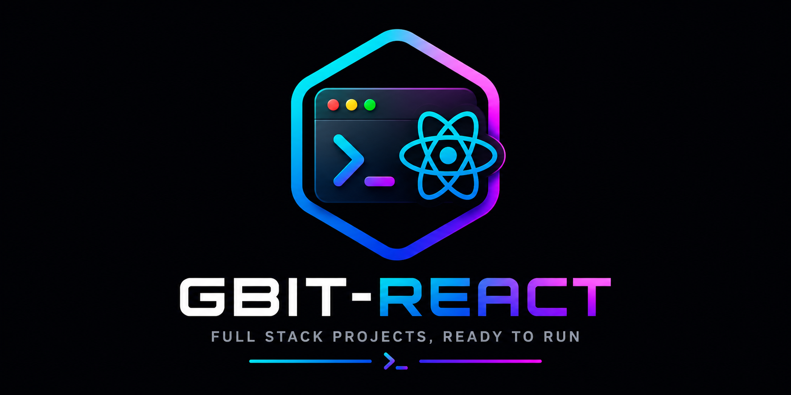

<p align="center">
  
</p>
<p align="center">

<a href="https://www.npmjs.com/package/gbit-react">

</a>

<a href="https://github.com/Gislaine-programadora/gbit-react">

</a>

<a href="https://www.linkedin.com/in/gislaine-programadora/">

</a>

</p>

<h2 align="center">
🚀 Build Full Stack React Applications in Minutes
</h2>

<p align="center">
Generate complete React + backend (Node or Go) + PostgreSQL projects, ready to run.
</p>

<hr>

<h1 align="center">GBIT React</h1>


<p align="center">Full Stack CLI — choose your backend, get a working app.</p>

<p align="center">


</p>

<p align="center">


</p>

<p align="center">


</p>

---

## 🌍 Vision

GBIT React was created to simplify the development of modern full stack applications.

Instead of starting from an empty project, developers choose the backend technology they prefer — **Node.js/Express** or **Go/Fiber** — and instantly receive a complete architecture with React, database integration, Docker, and real authentication already wired up.

The goal is to reduce setup time and provide a solid, working foundation — not a mockup — for startups, companies, and freelance developers.

📦 [Pacote no NPM](https://www.npmjs.com/package/gbit-react) · 💻 [Repositório no GitHub](https://github.com/Gislaine-programadora)


## ✨ Features

Com um único comando, o `gbit-react` gera:

- ⚛️ **Frontend**: React 19 + Vite + TypeScript, com um formulário de login/registro/dashboard já funcional
- 🔌 **Cliente HTTP configurado**: Axios com renovação automática de token (refresh transparente quando o access token expira)
- 🔐 **Autenticação JWT real**: registro, login, refresh e rota protegida de exemplo, com senha criptografada (bcrypt)
- 🗄️ **Banco de dados**: PostgreSQL, já orquestrado via Docker Compose
- 🐳 **Docker pronto**: `docker compose up` sobe backend + banco juntos

**Você escolhe o backend na hora de gerar:**

| Opção | Stack |
|---|---|
| **Node.js** (padrão) | Express + Prisma ORM |
| **Go** | Fiber + GORM |

Os dois entregam exatamente os mesmos endpoints de autenticação (`/api/auth/register`, `/login`, `/refresh`, `/me`), então trocar de stack não muda como o frontend consome a API.

## 📦 Instalação

```bash
npx gbit-react
```

Ou, se preferir instalar globalmente:

```bash
npm install -g gbit-react
gbit-react
```

## 📁 Estrutura gerada

```text
meu-projeto/
  frontend/              # React + Vite + TypeScript
  backend/                # Node+Express+Prisma OU Go+Fiber+GORM (sua escolha)
  docker-compose.yml         # orquestra backend + banco de dados juntos
```

## ⚛️ Frontend

- React 19 + Vite + TypeScript
- Axios (com interceptor de renovação de token)
- Tela de login/registro/dashboard já funcional, pronta para você adaptar

## 🌐 Backend

**Se escolher Node.js:**
- Express + Prisma ORM
- Schema com model `User` pronto para expandir
- Middleware de autenticação JWT reutilizável

**Se escolher Go:**
- Fiber (framework web) + GORM (ORM)
- Migração automática do model `User`
- Mesma lógica de autenticação, no mesmo padrão do backend Node

**Em ambos:**
- Rotas de `register`, `login`, `refresh` e `me` (protegida)
- Senhas com hash (bcrypt)
- Docker multi-stage para build enxuto

## 🚀 Como rodar o projeto gerado

```bash
cd meu-projeto
cp backend/.env.example backend/.env   # configure suas chaves
docker compose up --build              # sobe backend + banco de dados
cd frontend && npm run dev              # roda o frontend
```

## 🗺️ Roadmap

- [x] React + Vite + TypeScript
- [x] Backend Node.js (Express + Prisma)
- [x] Backend Go (Fiber + GORM)
- [x] Docker Compose (API + PostgreSQL)
- [x] Autenticação JWT completa (register/login/refresh)
- [ ] Documentação de API (Swagger)
- [ ] Upload de arquivos
- [ ] Camada de validação dedicada (ex: Zod/Joi)
- [ ] Redis
- [ ] WebSockets
- [ ] Provedores de autenticação externos (Google, GitHub)
- [ ] Módulo de pagamentos

## 🎯 Objetivo

Criar aplicações full stack funcionais em poucos minutos, com autenticação de verdade — não um mockup — como ponto de partida real para:

- Startups e empresas
- Projetos acadêmicos
- Freelancers
- MVPs e provas de conceito

## 🤝 Ecossistema Gbit

| Ferramenta | Descrição |
|---|---|
| [`gbit-next`](https://github.com/Gislaine-programadora) | Projetos Next.js com templates prontos |
| [`gbit-start`](https://github.com/Gislaine-programadora) | Abre ou clona qualquer projeto existente |
| [`gbit-readme`](https://github.com/Gislaine-programadora) | Gera README profissional automaticamente |
| [`gbit-address`](https://github.com/Gislaine-programadora) | Gera pares de chaves para testes Web3 |
| [`gbit-react`](https://github.com/Gislaine-programadora) | Este CLI — projetos full stack React |


## 📄 Licença

MIT © [Gislaine Cristina Lopes Fernandes](https://github.com/Gislaine-programadora)